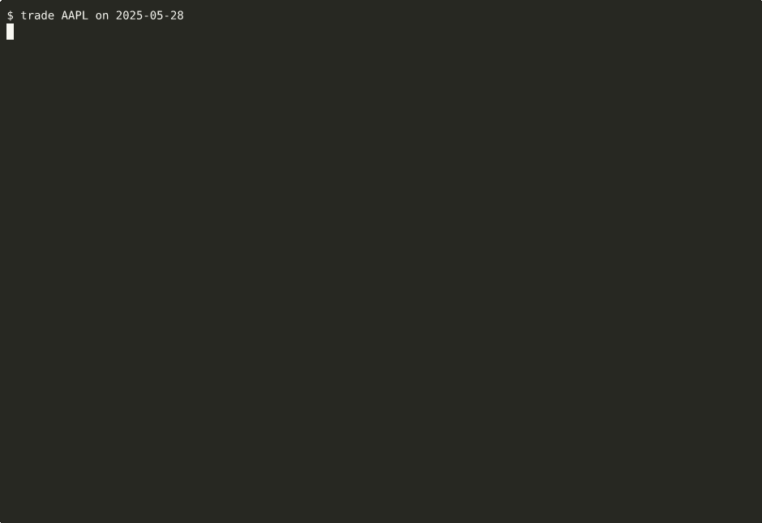

# trading-analysis

Five financial-agent skills (trading, pair trading, auditing, report
generation, report evaluation) plus the MCP server and data plumbing they
depend on. All five skills run against a single shared DuckDB (8-symbol
pool) exposed through the `trading_mcp` MCP server.

## Demo

One user prompt — `trade AAPL on 2025-05-28` — drives the trading skill
end to end via Claude Code: spawn the `trading_mcp` MCP server, fetch
prices / news / filings / indicators, reason over the data, write a
single upserted record to `results/trading/`. ~110 s, ~$0.30 wall cost.



The `openclaw` YAML harness is a real spec, not just paper. The minimal
runner at `scripts/openclaw_run.py` loads `openclaw/skills/skill.trading.yaml`,
extracts the model + MCP server config, and dispatches the same flow
through Claude Code. Same outcome, packaged behind the openclaw entry
point so the spec has a working reference implementation.

```bash
python3 scripts/openclaw_run.py --symbol AAPL --target-date 2025-05-28
```


The skill definitions are consumed two ways:

- **Claude Code** reads each skill's Markdown at `<skill>/SKILL.md` (human-readable, prose procedure).
- **openclaw** reads the YAML projection at `openclaw/skills/skill.<name>.yaml` (machine-parseable spec with routing, input schema, constraints, MCP / tool declarations, and output artifact templates).

Each YAML sets `procedure_source: ../../<skill>/SKILL.md`, so the Markdown
is the canonical source of truth and the YAML is the machine projection.

## Skills

| Skill | Output | One-line purpose |
|---|---|---|
| `trading` | `results/trading/trading_{SYMBOL}_{agent}_{model}.json` (upsert keyed by date) | One daily BUY/SELL/HOLD decision per invocation using the 5 `trading_mcp` tools. Caller loops over dates for replay or live mode. |
| `pair_trading` | `results/pair_trading/{agent}_pair_trading_{pair}_{model}.json` (single write at end) | Daily pair-trading simulation over 2025-03-01 to 2025-05-31 on the 8-symbol pool. Pair selected once on the first trading day using only visible signals, then traded chronologically with LONG_SHORT / SHORT_LONG / HOLD actions. |
| `auditing` | `results/auditing/{agent}_auditing_{SYMBOL}_{document_type}_{date}_{audit_id}_{model}.json` (single JSON) | Per-filing MD&A vs Risk Factors consistency audit. Given one (symbol, date, document_type, audit_id) tuple, extracts notable MD&A claims and classifies each against the Risk Factors section as covered / partial / absent / contradictory. |
| `report_generation` | ~13 Markdown files inside `results/report_generation/{agent}_report_generation_{SYMBOL}_{model}/` | One weekly equity research report per Monday over a 3-month window. 8 sections, 11 required metrics computed from adj_close, graduated Strong BUY / BUY / HOLD / SELL / Strong SELL rating. |
| `report_evaluation` | `results/report_evaluation/{agent}_report_evaluation_{SYMBOL}_{model}.json` | Scores a run of weekly reports along five dimensions: quantitative price-prediction simulation, structure, content accuracy, evidence fidelity vs MCP data, and reasoning quality. |

## Symbol pool

All skills operate on the 8 symbols available in the TheFinAI/ab DuckDB:

```
AAPL, ADBE, AMZN, GOOGL, META, MSFT, NVDA, TSLA
```

## Layout

```
trading-analysis/
├── <skill>/SKILL.md              # one per skill, canonical procedure
├── trading/
│   ├── mcp/trading_mcp.py        # MCP server exposing 5 tools over DuckDB
│   ├── mcp/schema.sql            # prices (OHLCV) / news / filings tables
│   └── env/                      # runtime DuckDB (gitignored)
├── openclaw/
│   ├── openclaw.config.example.yaml
│   ├── providers/provider.claude.yaml
│   ├── routers/router.trading-suite.yaml
│   └── skills/skill.<name>.yaml
├── agents/                       # read-only driver scripts that emit prompts
├── scripts/download_data.py      # pulls trading_env.duckdb from HF
├── tests/smoke/                  # deterministic smoke tests, no API calls
└── .mcp.json                     # wires trading_mcp into Claude Code
```

## Data

The canonical data is a DuckDB file published at HuggingFace dataset
**TheFinAI/ab**. Three tables:

| Table | Columns | Coverage |
|---|---|---|
| `prices` | `id, symbol, date (DATE), open, high, low, close, adj_close, volume` | 8 symbols, 2024-01-02 to 2025-05-30 |
| `news` | `id, symbol, date (TIMESTAMP), title, url, highlights` | 8 symbols, 2009-04-20 to 2026-04-11 |
| `filings` | `id, symbol, date (DATE), mda_content, risk_content, document_type` | 8 symbols, 14 × 10-K + 34 × 10-Q, 2023-12-01 to 2025-04-27 |

`adj_close` is the canonical trading price (used by `get_prices`,
`get_indicator`, and all skill metric computations). Filings have MD&A and
Risk Factors sections pre-extracted; there is no raw XBRL.

Download the DuckDB before running any skill:

```bash
python scripts/download_data.py
# places trading_env.duckdb into trading/env/
```

Set `TRADING_DB_PATH` to override the default location.

## Running under Claude Code

`.mcp.json` at the repo root is already configured. From the repo root,
start a Claude Code session and invoke a skill by describing the task:

- `trade AAPL on 2025-03-05`
- `run pair trading on the 8 symbols`
- `audit the AAPL 10-K released 2024-09-28 (id: mr_1)`
- `generate weekly reports for NVDA`
- `evaluate the codex reports for AAPL`

Drivers under `agents/` batch-emit prompts for a date range or run folder:

```bash
python agents/run_trading.py --symbol AAPL --start 2025-03-01 --end 2025-03-31 --weekdays-only
python agents/run_pair_trading.py
python agents/run_report_generation.py --symbol NVDA
python agents/run_report_evaluation.py --symbol AAPL
python agents/run_auditing.py --symbol AAPL --document-type 10-K
```

Drivers are read-only on the repo (the auditing driver reads the DB to
enumerate filings). They print prompts to stdout; pipe or paste into a
session to execute.

## Running under openclaw

1. Install the openclaw engine (separate project) and point it at `openclaw/openclaw.config.example.yaml`.
2. Set `ANTHROPIC_API_KEY`. Default model is `claude-sonnet-4-6`; `claude-opus-4-7` is declared as the large-context alternative for report evaluation.
3. The router dispatches with priority `pair_trading (95) > report_evaluation (92) > report_generation (90) > auditing (88) > trading (85)`, so `"pair"` wins over bare `"trade"` and `"evaluate reports"` wins over bare `"report"`.

The openclaw skill schema extends the template with `mcp_servers`, `tools`,
`runtime`, `input_artifacts`, `output_artifacts`, `constraints`, `procedure`,
and `procedure_source`. The openclaw engine needs loaders for these fields
to execute the procedural skills.

## Smoke tests

Deterministic verification of the `trading_mcp` server and the trading
SKILL.md decision branches. No API calls.

```bash
python tests/smoke/seed_db.py         # creates a small AAPL DuckDB (40 trading days)
python tests/smoke/run_tools.py       # exercises all 5 MCP tools
python tests/smoke/run_skill_logic.py # walks the decision branches (weekend, holiday, normal)
```

See `tests/smoke/README.md` for details. Seed includes Presidents Day 2025
and MLK Day 2025 as real market holidays so the missing-row HOLD branch is
exercised.

## Dependencies

- Python 3.11+
- `duckdb`, `fastmcp`, `pandas`, `numpy`, `pydantic`, `huggingface_hub`
- `pandas-ta` is declared in `trading/mcp/requirements.txt`, but every PyPI
  version compatible with Python 3.11 has been yanked. On 3.11 use the shim
  at `tests/smoke/pandas_ta_shim.py` (~50 lines, covers `sma` / `rsi` /
  `bbands` / `macd`), or upgrade to Python 3.12, or inline the four
  indicators into `trading_mcp.py`.
